# JAMES MURPHY TERMINAL PROJECT

## ${\textsf{\color{blue}PROJECT REPOSITORY - JAMESMURPHY T1A3}}$

[**Link To GitHub Repository**](https://github.com/SteaneMurphy/Terminal-Marketplace)

Clone (HTTPS): https://github.com/SteaneMurphy/Terminal-Marketplace.git

## ${\textsf{\color{blue}PROJECT DESCRIPTION}}$

This application runs in the terminal or command line. It is a simulated fantasy marketplace, similar to what you would find in a video game. The marketplace facilitates users buying and selling items to one another

## ${\textsf{\color{blue}APPLICATION FEATURES}}$

### ${\textsf{\color{darkorange}MAJOR FEATURES}}$

### _NEW USER SIGNUP_

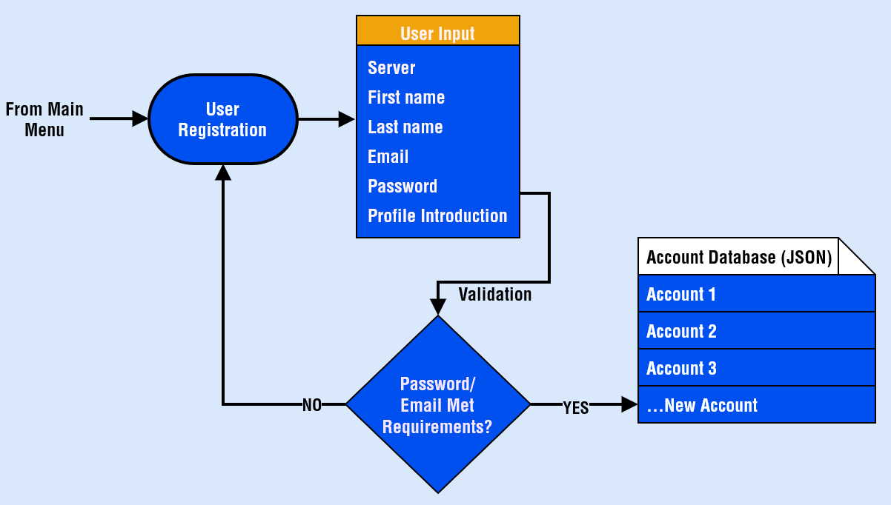

This feature allows the user to create a new account. This account is checked against existing character username/server combinations to verify that the game character exists.

Once the user enters their username and server, it is checked against the character and server list for a match.

The email address the user enters is checked against Regular Expressions to ensure a valid format is being entered.

The password the user enters is checked against Regular Expressions to ensure that the password meets the minimum requirements. Those requirements are:

- Minimum 8 characters
- At least one uppercase and one lowecase letter
- At least one number
- At least one special characer (ie; "!" or "$")

Once the user has successfully answered all of the input prompts, a new account class is instantiated, the input data transferred to this class, and the account class data exported to the JSON file (pretend database).

The user is then returned to the main menu to log in.

### _USER LOG IN_

This feature prompts the user to log into their account.

The user is prompted to enter their email or username, as well as their password. These values are checked against existing account entries in the JSON file (pretend database).

The user is given three attempts to log in successfully. If by the third attempt, the user has failed to log in successfully, they are returned to the main menu screen.

If a correct match is found, the user is sent to the logged in menu screen.

### _MARKETPLACE: DISPLAY ITEMS_

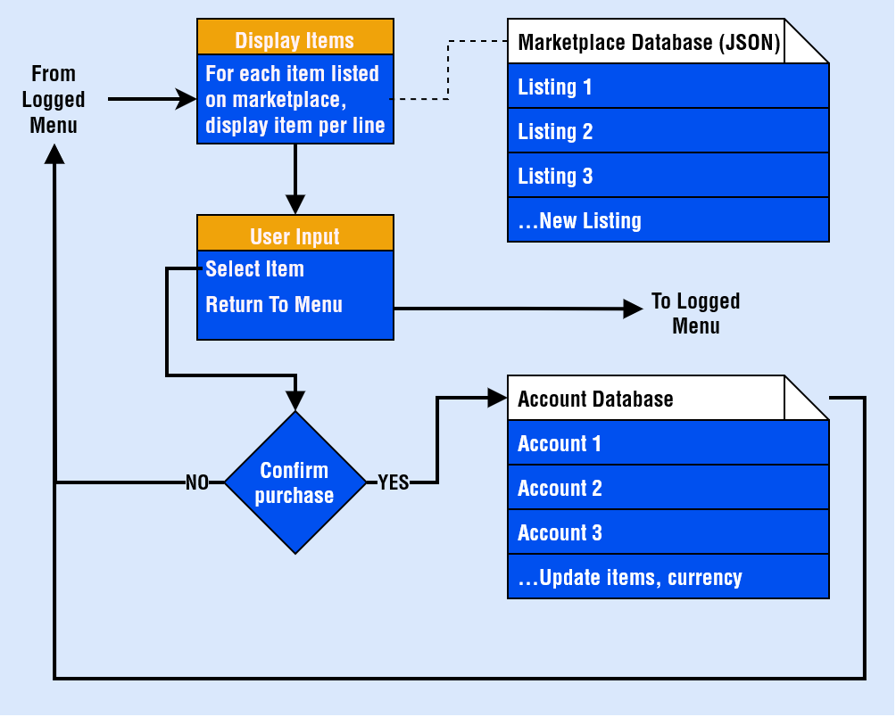

This feature lists all items for sale on the marketplace. The user can also buy an item directly from this screen.

The marketplace JSON file (pretend database) is queried and for each entry in this file, a corresponding entry is listed into the terminal. These entries are listed in order by number.

The user can select any of these items to view an item description and purchase the item.

If the user purchases the item, their currency is checked to see if they have enough to purchase, the item is removed from the sellers account and added to the users account and the user and seller currency is adjusted accordingly. These value are all updated in the relevant JSON files (marketplace items and account details).

The user can refuse to purchase an item and return to the item listing or return to the logged in menu.

### _MARKETPLACE: USER LIST ITEM_

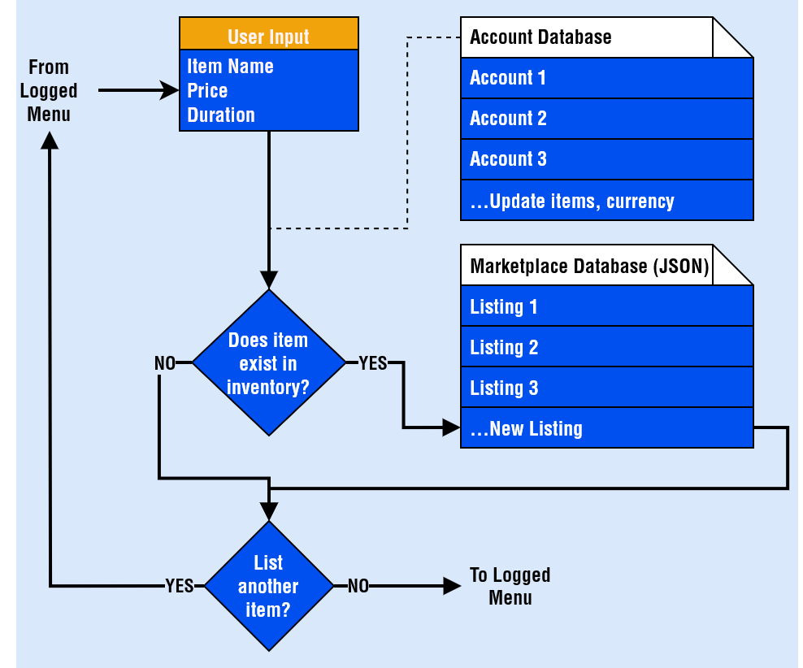

This feature allows the user to list an item for sale on the marketplace.

The user is prompted to enter the item name, the sell price and the duration the item should be listed for.

The user's account information (JSON file) is queried and checked to see if the item exists in the user's inventory. If it does, the item is marked as unusable and is listed on the marketplace. This means that the item details are updated on the marketplace JSON file.

Whilst an item is unusable, it cannot be traded, sold or used in the game (just a boolean in this case) to prevent item fraud.

### ${\textsf{\color{darkorange}MINOR FEATURES}}$

### _DISPLAY INVENTORY_

This minor feature will display all items in the player's inventory on the screen. The items are listed by querying the account details in the account JSON file.

The user is returned to the logged in menu, after pressing a key.

### _DISPLAY CURRENCY_

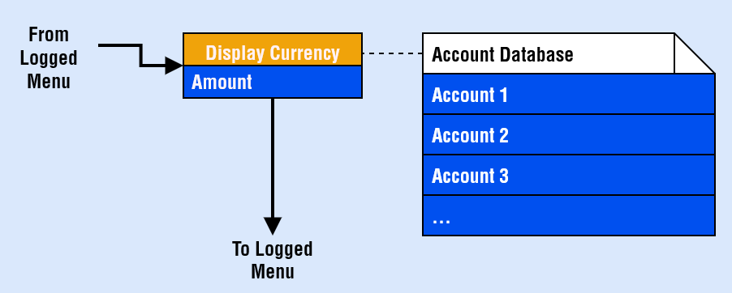

This minor feature will display the current currency amount possessed by the user. This value is checked by querying the account details in the account JSON file.

The user is returned to the logged in menu, after pressing a key.

## ${\textsf{\color{blue}IMPLEMENTATION PLAN}}$

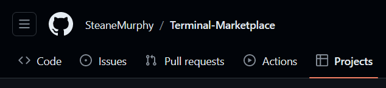

[**Link To Project Board**](https://github.com/users/SteaneMurphy/projects/1/views/1)

The software used to facilitate production and manage the project was _github projects_. This software works like a traditional Kanban board where tasks, issues or tickets can be created and listed under a parent category (column).

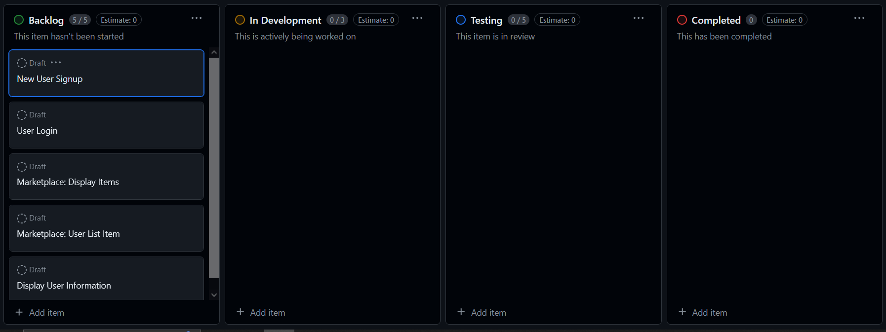

I created a column for each stage of a feature's development:

-  _Backlog_: features are listed here if they have not yet started development

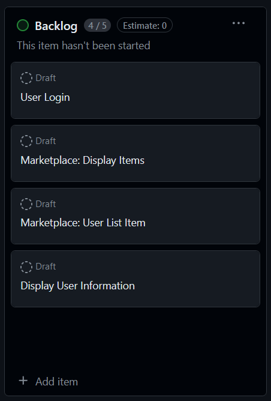

- _In Development_: features are moved here when they are being actively worked on (ie; coding has begun)

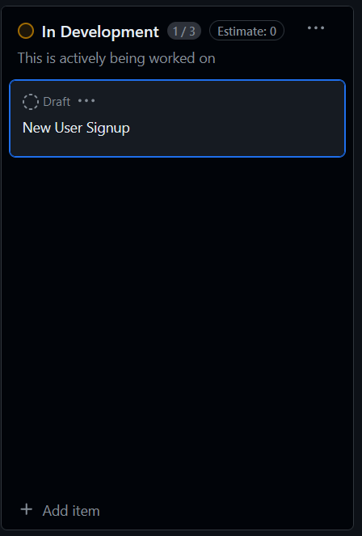

- _Testing_: features are moved to this column when development is finished and the feature needs to be tested

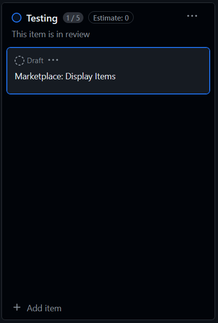

- _Completed_: features are moved to this column when it has been fully implemented and tested, and that no more work is to be done to it

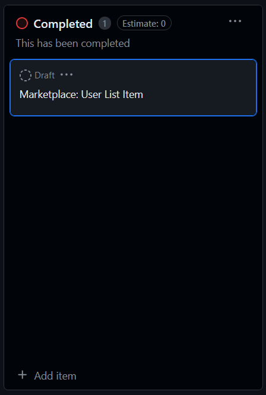

Each feature has its own issue or card. Under this card are relevant screenshots, development notes and commit references. Alongside this, the feature is broken down into multiple sub-tasks and listed as a checklist against the card.

### ${\textsf{\color{darkorange}F1 }}$ _MENUS_

[**Link To task**](https://github.com/users/SteaneMurphy/projects/1/views/1?pane=issue&itemId=61854427)
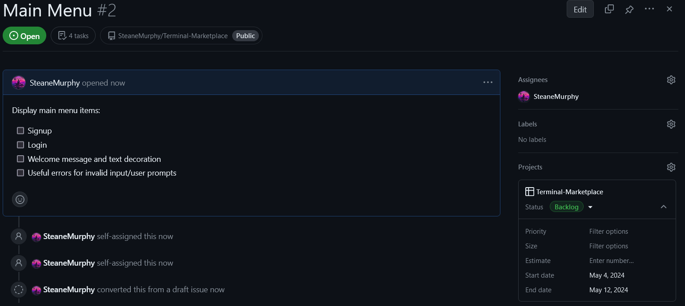

[**Link To task**](https://github.com/users/SteaneMurphy/projects/1/views/1?pane=issue&itemId=61854552)
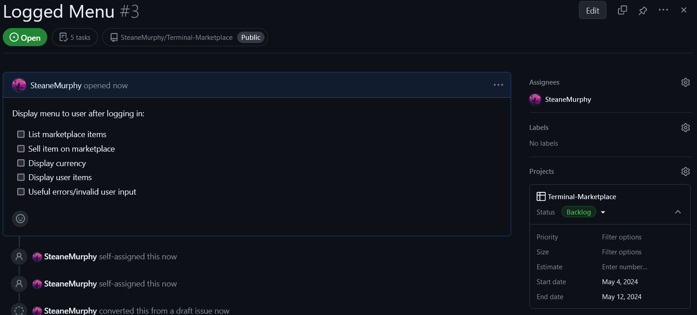

### ${\textsf{\color{darkorange}F2 }}$ _NEW USER SIGNUP_

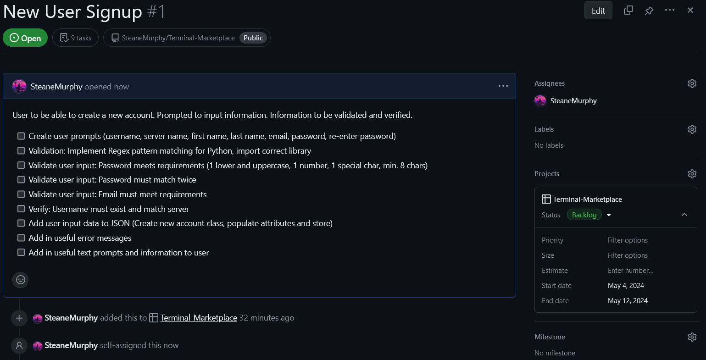

### ${\textsf{\color{darkorange}F3 }}$ _USER LOG IN_

### ${\textsf{\color{darkorange}F4 }}$ _MARKETPLACE: DISPLAY ITEMS_

### ${\textsf{\color{darkorange}F5 }}$ _MARKETPLACE: USER LIST ITEM_

### ${\textsf{\color{darkorange}F6 }}$ _DISPLAY INVENTORY / DISPLAY CURRENCY_

## ${\textsf{\color{blue}HELP}}$

_to add_

- steps to install the app
- dependencies
- system/hardware requirements
- how to use any command line arguments

## ${\textsf{\color{blue}STYLE GUIDES}}$

This project uses the following python style guides:

__PEP8__ - For code formatting, language usuage and best practice

- [**Link To PEP8 Guide**](https://peps.python.org/pep-0008/)

__PEP257__ - For docstring formatting best practice

- [**Link To PEP257 Guide**](https://peps.python.org/pep-0257/)

## ${\textsf{\color{blue}REFERENCES}}$