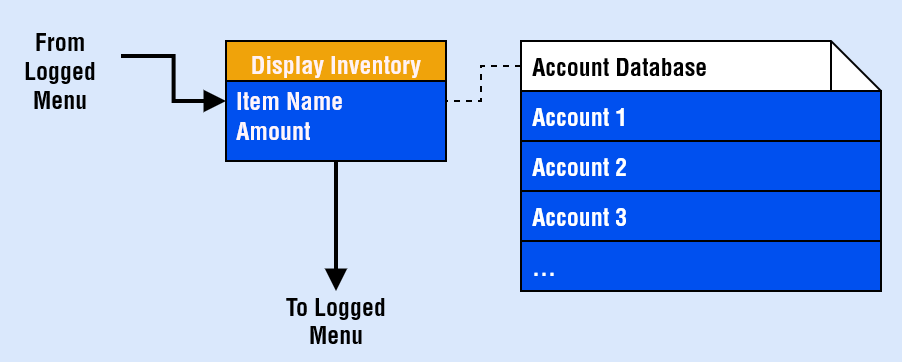

# JAMES MURPHY TERMINAL PROJECT

## ${\textsf{\color{blue}PROJECT REPOSITORY - JAMESMURPHY T1A3}}$

[**Link To GitHub Repository**](https://github.com/SteaneMurphy/Terminal-Marketplace)

Clone (HTTPS): https://github.com/SteaneMurphy/Terminal-Marketplace.git


## ${\textsf{\color{blue}PROJECT DESCRIPTION}}$

This application runs in the terminal or command line. It is a simulated fantasy marketplace, similar to what you would find in a video game. The marketplace facilitates users buying and selling items to one another

## ${\textsf{\color{blue}APPLICATION FEATURES}}$

### ${\textsf{\color{darkorange}MAJOR FEATURES}}$

### _NEW USER SIGNUP_


This feature allows the user to create a new account. This account is checked against existing character username/server combinations to verify that the game character exists.

Once the user enters their username and server, it is checked against the character and server list for a match.

The email address the user enters is checked against Regular Expressions to ensure a valid format is being entered.

The password the user enters is checked against Regular Expressions to ensure that the password meets the minimum requirements. Those requirements are:

- Minimum 8 characters
- At least one uppercase and one lowecase letter
- At least one number
- At least one special characer (ie; "!" or "$")

Once the user has successfully answered all of the input prompts, a new account class is instantiated, the input data transferred to this class, and the account class data exported to the JSON file (pretend database).

The user is then returned to the main menu to log in.

### _USER LOG IN_


This feature prompts the user to log into their account.

The user is prompted to enter their email or username, as well as their password. These values are checked against existing account entries in the JSON file (pretend database).

The user is given three attempts to log in successfully. If by the third attempt, the user has failed to log in successfully, they are returned to the main menu screen.

If a correct match is found, the user is sent to the logged in menu screen.

### _MARKETPLACE: DISPLAY ITEMS_


This feature lists all items for sale on the marketplace. The user can also buy an item directly from this screen.

The marketplace JSON file (pretend database) is queried and for each entry in this file, a corresponding entry is listed into the terminal. These entries are listed in order by number.

The user can select any of these items to view an item description and purchase the item.

If the user purchases the item, their currency is checked to see if they have enough to purchase, the item is removed from the sellers account and added to the users account and the user and seller currency is adjusted accordingly. These value are all updated in the relevant JSON files (marketplace items and account details).

The user can refuse to purchase an item and return to the item listing or return to the logged in menu.

### _MARKETPLACE: USER LIST ITEM_


This feature allows the user to list an item for sale on the marketplace.

The user is prompted to enter the item name, the sell price and the duration the item should be listed for.

The user's account information (JSON file) is queried and checked to see if the item exists in the user's inventory. If it does, the item is marked as unusable and is listed on the marketplace. This means that the item details are updated on the marketplace JSON file.

Whilst an item is unusable, it cannot be traded, sold or used in the game (just a boolean in this case) to prevent item fraud.

### ${\textsf{\color{darkorange}MINOR FEATURES}}$

### _DISPLAY INVENTORY_



This minor feature will display all items in the player's inventory on the screen. The items are listed by querying the account details in the account JSON file.

The user is returned to the logged in menu, after pressing a key.

### _DISPLAY CURRENCY_


This minor feature will display the current currency amount possessed by the user. This value is checked by querying the account details in the account JSON file.

The user is returned to the logged in menu, after pressing a key.

## ${\textsf{\color{blue}IMPLEMENTATION PLAN}}$


[**Link To Project Board**](https://github.com/users/SteaneMurphy/projects/1/views/1)


The software used to facilitate production and manage the project was _github projects_. This software works like a traditional Kanban board where tasks, issues or tickets can be created and listed under a parent category (column).


I created a column for each stage of a feature's development:

-  _Backlog_: features are listed here if they have not yet started development


- _In Development_: features are moved here when they are being actively worked on (ie; coding has begun)


- _Testing_: features are moved to this column when development is finished and the feature needs to be tested


- _Completed_: features are moved to this column when it has been fully implemented and tested, and that no more work is to be done to it


Each feature has its own issue or card. Under this card are relevant screenshots, development notes and commit references. Alongside this, the feature is broken down into multiple sub-tasks and listed as a checklist against the card.

### ${\textsf{\color{darkorange}F1 }}$ _MENUS_

This feature will display either the main menu or the logged-in menu to the user. The menu will be displayed as a numbered list of options that the user can select from. Once selected, a switch statement will call the relevant function.

[**Link To task**](https://github.com/users/SteaneMurphy/projects/1/views/1?pane=issue&itemId=61854427)


[**Link To task**](https://github.com/users/SteaneMurphy/projects/1/views/1?pane=issue&itemId=61854552)


### ${\textsf{\color{darkorange}F2 }}$ _NEW USER SIGNUP_

This feature will allow a user to sign up to the marketplace. The user is prompted for input for the following fields (username, server name, first name, last name, email, password, confirmed password). The following fields are checked against validation requirements (email, password, confirm password). The following fields are checked against the server database (JSON file) to see if user is a player (username, server name).

If these fields pass validation, a new account class is created, its attributes populated and the data added to the account database (JSON file) as a new account.

[**Link To task**](https://github.com/users/SteaneMurphy/projects/1/views/1?pane=issue&itemId=61853779)


### ${\textsf{\color{darkorange}F3 }}$ _USER LOG IN_

This feature will allow an existing user to log into the marketplace. The user is prompted for input for the following fields (username or email, password). These fields are checked against the account database (JSON file). If the username/email exists and the password matches the password stored on the account details, the user is presented with the logged-in menu.

[**Link To task**](https://github.com/users/SteaneMurphy/projects/1/views/1?pane=issue&itemId=61853782)


### ${\textsf{\color{darkorange}F4 }}$ _MARKETPLACE: DISPLAY ITEMS_

This feature will display all available items for sale in the marketplace to the user. The marketplace database (JSON file) is queried and each item in the file is displayed and numbered on the screen.

The user is prompted for input and can select any of the items for purchase. The user is prompted to confirm their choice. The currency requested for the item is checked against the user account information. If the user has sufficient currency, the item is removed from the marketplace and the seller's account, transferred to the user account, and the currency amounts of both the buyer and seller and adjusted.

These values are adjusted in the account and marketplace database respectively.

[**Link To task**](https://github.com/users/SteaneMurphy/projects/1/views/1?pane=issue&itemId=61853787)


### ${\textsf{\color{darkorange}F5 }}$ _MARKETPLACE: USER LIST ITEM_

This feature allows a user to list an item they own for sale on the marketplace.

The user is prompted for input for the the following fields (item name, sale price, duration). The item name is checked against the user's item list in the account database (JSON file). If it is found, the item is locked and its information sent to the marketplace database (JSON file).

[**Link To task**](https://github.com/users/SteaneMurphy/projects/1/views/1?pane=issue&itemId=61853791)


### ${\textsf{\color{darkorange}F6 }}$ _DISPLAY INVENTORY / DISPLAY CURRENCY_

This feature allows a user to query their currency amount and list what items exist in their inventory.

The user is prompted for input for either choice. The relevant field is checked against the account database (JSON file) and the results returned and displayed on the screen.

[**Link To task**](https://github.com/users/SteaneMurphy/projects/1/views/1?pane=issue&itemId=61853810)


## ${\textsf{\color{blue}HELP}}$

### ${\textsf{\color{darkorange}1 }}$ INSTALLATION

To successfully run the program, please follow the following steps:

- download the latest git repository
```shell
git clone https://github.com/SteaneMurphy/Terminal-Marketplace.git
```
- in the terminal, navigate to the source folder, named "src"
```shell
<cloned directory>: cd src
```
- ensure you have python3.10 or later installed
```shell
<cloned directory>: python3 --version
```
- to install python3 (if required)
```shell
sudo apt-update python3
```
- once in the 'src' directory, enable the install script to run
```shell
chmod +x install.sh
```
- for first time execution run the install command, this will install any dependencies, a virtual environment and run the application
```shell
source ./install.sh --install

or

source ./install.sh -i
```
- for returning users (using the same virtual environment), this will activate your virtual environment and run the application
```shell
source ./install.sh --run

or

source ./install.sh -r
```
- these commands can be viewed by using the help command
```shell
source ./install.sh --help

or

source ./install.sh -h
```

### ${\textsf{\color{darkorange}2 }}$ DEPENDENCIES

The following is a list of required modules for the program to successfully run. These dependencies can be automatically checked and installed by running the following command

```shell
source ./install.sh --install
```

The install command must be run from the 'src' directory inside the cloned project directory

- _ascii-magic==2.3.0_
- _black==24.4.2_
- _certifi==2024.2.2_
- _charset-normalizer==3.3.2_
- _click==8.1.7_
- _colorama==0.4.6_
- _idna==3.7_
- _mypy-extensions==1.0.0_
- _packaging==24.0_
- _pathspec==0.12.1_
- _pillow==10.3.0_
- _platformdirs==4.2.1_
- _pycodestyle==2.11.1_
- _termcolor==2.4.0_
- _tomli==2.0.1_
- _typing_extensions==4.11.0_
- _urllib3==2.2.1_

### ${\textsf{\color{darkorange}3 }}$ SYSTEM REQUIREMENTS

The only system requirement is a modern terminal like Ubuntu and python3.10 or greater

Please run this application in a full-screen terminal

## ${\textsf{\color{blue}STYLE GUIDES}}$


This project uses the following python style guides:

__PEP8__ - For code formatting, language usuage and best practice

- [**Link To PEP8 Guide**](https://peps.python.org/pep-0008/)

## ${\textsf{\color{blue}REFERENCES}}$

Damnever, 2023, Automatically create 'file-requirements.txt', _StackOverflow_, web log post, 22 June, viewed 10 May 2024, 
https://github.com/SteaneMurphy/Terminal-Marketplace

GeeksForGeeks, 2022, _Reading and Writing JSON to a File in Python_, viewed 6 May 2024, 
https://www.geeksforgeeks.org/reading-and-writing-json-to-a-file-in-python/

Makwana, D, 2023, Automating Virtual Environments: Bash Script Magic For Python Developers, _Medium_, web log post, 12 August, viewed 10 May 2024, 
https://makwanadhruv.medium.com/automating-virtual-environments-bash-script-magic-for-python-developers-3a06df1777a6

Rossum, G 2013, PEP 8 – Style Guide for Python Code, _Python Enhancement Proposals_, viewed 2 May 2024, 
https://peps.python.org/pep-0008/

Verma, A 2019, Getter and Setter in Python, _GeeksForGeeks_, web log post, 4 December, viewed 4 May 2024, 
https://www.geeksforgeeks.org/getter-and-setter-in-python/

Voilalex, 2021, Automatic requirements.txt updating approach, _StackOverflow_, web log post, 22 December, viewed 10 May 2024, 
https://stackoverflow.com/questions/46419607/how-to-automatically-install-required-packages-from-a-python-script-as-necessary

Vogel, T 2011, Simulating ENTER keypress in bash script, _StackOverflow_, web log post, 28 October, viewed 10 May 2024, 
https://stackoverflow.com/questions/6264596/simulating-enter-keypress-in-bash-script

W3Schools, n.d., _Python Try Except_, viewed 4 May 2024, 
https://www.w3schools.com/python/python_try_except.asp