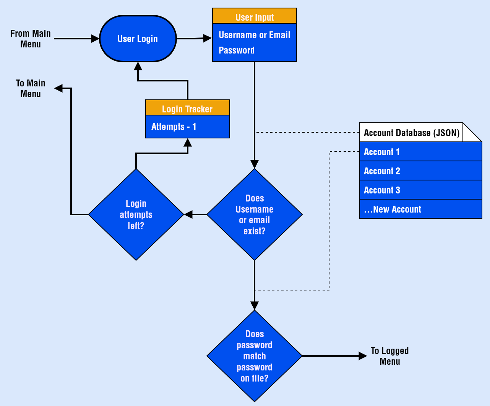

# JAMES MURPHY TERMINAL PROJECT

## PROJECT REPOSITORY - JAMESMURPHY_T1A3

[**Link To GitHub Repository**](https://github.com/SteaneMurphy/Terminal-Marketplace)

Clone (HTTPS): https://github.com/SteaneMurphy/Terminal-Marketplace.git

## PROJECT DESCRIPTION

This application runs in the terminal or command line. It is a simulated fantasy marketplace, similar to what you would find in a video game. The marketplace facilitates users buying and selling items to one another

## APPLICATION FEATURES

### _NEW USER SIGNUP_

### _USER LOG IN_

## IMPLEMENTATION PLAN

## HELP

## STYLE GUIDES

## REFERENCES